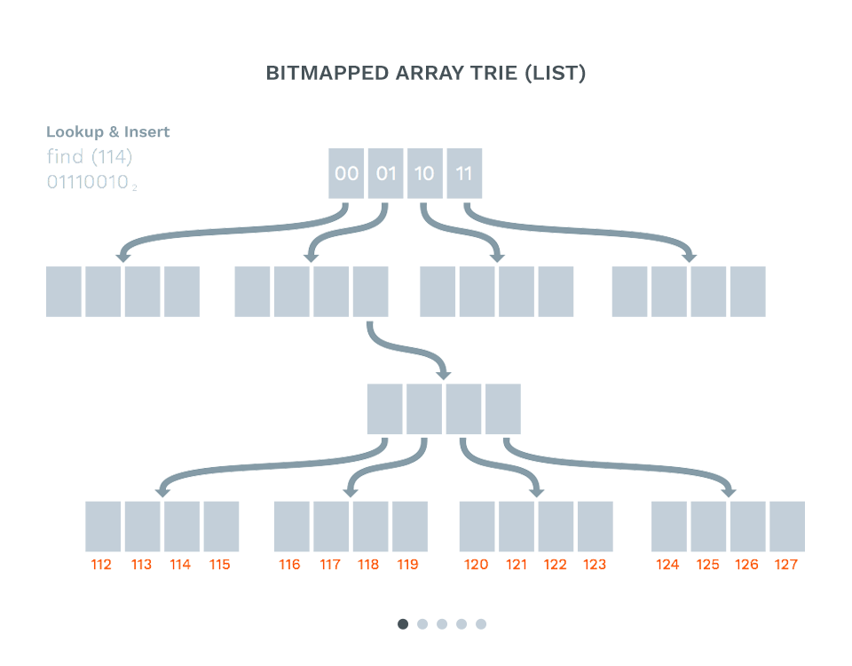

# Списъци и речници

#HSLIDE

## Списъци


#HSLIDE

```elixir
[1, :two, "three", %{four: 4}, 'five', [6, [:seven], "eight"]]
```

#HSLIDE

#### [head | tail]

```
+-|-+  +-|-+  +-|-+  +-|-+  +-|-+
|1| -->|2| -->|3| -->|4| -->|5| |
+-|-+  +-|-+  +-|-+  +-|-+  +-|-+
```

#HSLIDE

#### Конструиране

```elixir
a = [1, 2, 3]    # [1, 2, 3]
b = [0 | a]      # [0, 1, 2, 3]
c = [-2, -1 | b] # [-2, -1, 0, 1, 2, 3]
d = [a | b]      # [[1, 2, 3], 0, 1, 2, 3]
e = a ++ b       # [1, 2, 3, 0, 1, 2, 3]
```

#HSLIDE

#### Pattern Matching

```elixir
[a | b] = [1, 2, 3]
a  # 1
b  # [2, 3]
[x, y | z] = [4, 5]
x  # 4
y  # 5
z  # []
```

#HSLIDE

#### Pattern Matching

```elixir
[[{x, _} | a] | b] = [[{9, 10} , 2, 3], 0]
x  # 9
a  # [2, 3]
b  # [0]
```

#HSLIDE

### Recursion all the way down


#HSLIDE

#### Обхождане (Рекурсия)

```elixir
defmodule ListUtils do
  def length([]), do: 0
  def length([_head | tail]), do: 1 + length(tail)
end

ListUtils.length(["cat", "dog", "fish", "horse"]) # 4
```

#HSLIDE

```
ListUtils.length(["cat", "dog", "fish", "horse"])
= 1 + ListUtils.length(["dog", "fish", "horse"])
= 1 + 1 + ListUtils.length(["fish", "horse"])
= 1 + 1 + 1 + ListUtils.length(["horse"])
= 1 + 1 + 1 + 1 + ListUtils.length([])
= 1 + 1 + 1 + 1 + 0
= 4
```

#HSLIDE

#### Обхождане (Опашкова рекурсия)

```elixir
defmodule ListUtils do
  def length(list) when is_list(list), do: do_length(list)

  defp do_length(list, n \\ 0)
  defp do_length([], n), do: n
  defp do_length([head | tail], n), do: do_length(tail, n + 1)
end
```

#HSLIDE

#### Reduce

```elixir
defmodule ListUtils do
  def reduce(list, func, acc \\ 0)
  when is_list(list) and is_function(func) do
    do_reduce(list, func, acc)
  end

  def do_reduce([], _func, acc), do: acc
  def do_reduce([head | tail], func, acc) do
    do_reduce(tail, func, func.(head, acc))
  end
end
```

#HSLIDE

#### Reduce

```elixir
list_length
 = &ListUtils.reduce(&1, fn _, acc -> 1 + end, 0)

list_length.(["cat", "dog", "horse"]) # 3
```


#HSLIDE

#### Изграждане

```elixir
defmodule ListUtils do
  def filter(list, predicate)
  when is_list(list) and is_function(predicate) do
    do_filter(list, predicate)
  end

  defp do_filter(list, predicate, result \\ [])
  defp do_filter([], _predicate, result), do: result
  defp do_filter([head | tail], predicate, result) do
    case predicate.(head) do
      true -> do_filter(tail, predicate, result ++ [head])
      false -> do_filter(tail, predicate, result)
    end
  end
end
```

#HSLIDE

#### Изграждане

```elixir
ListUtils.filter([1,2,3,4,5], &(rem(&1, 2) == 0)) # => [2, 4]
```

#HSLIDE

```elixir
a = [1,2,3]
b = a ++ [4]
```

vs.

```elixir
a = [1,2,3]
b = [0 | a]
```

#HSLIDE

#### Изграждане

```elixir
defmodule ListUtils do
  def reverse(list) when is_list(list) do
    do_reverse(list)
  end

  defp do_reverse(list, result \\ [])
  defp do_reverse([], result), do: result
  defp do_reverse([head | tail], result) do
    do_reverse(tail, [head | result])
  end
end
```

#HSLIDE

#### Изграждане

```elixir
ListUtils.reverse([1, 2, 3, 4, 5]) # [5, 4, 3, 2, 1]
```


#HSLIDE

#### Изграждане

```elixir
defmodule ListUtils do
  def filter(list, predicate)
  when is_list(list) and is_function(predicate) do
    do_filter(list, predicate)
  end

  defp do_filter(list, predicate, result \\ [])
  defp do_filter([], _predicate, result), do: reverse(result)
  defp do_filter([head | tail], predicate, result) do
    case predicate.(head) do
      true -> do_filter(tail, predicate, [head | result])
      false -> do_filter(tail, predicate, result)
    end
  end
end
```

#HSLIDE

#### Изграждане

```elixir
ListUtils.filter([1,2,3,4,5], &(rem(&1, 2) == 0)) # [2, 4]
```

#HSLIDE

#### Map

```elixir
defmodule ListUtils do
  def map(list, func)
  when is_list(list) and is_function(func) do
    do_map(list, func)
  end

  def do_map(list, func, result \\ [])
  def do_map([], _func, result), do: reverse(result)
  def do_map([head | tail], func, result) do
    do_map(tail, func, [func.(head) | result])
  end
end
```

#HSLIDE

#### Map

```elixir
ListUtils.map([1,2,3,4,5], &(&1 * &1)) [1,4,9,16,25]
```

#HSLIDE

#### Няколко съвета

- отворете и разгледайте документацията на `List` модула
- внимавайте при конструирането на списъци
- научете какво е опашкова рекурсия
- ако обръщате списък, използвайте `Enum.reverse/1` или `:list.reverse/1`

#HSLIDE

```elixir
defmodule Enum
  @spec reverse(t) :: list
  def reverse(enumerable)

  def reverse([]), do: []
  def reverse([_] = list), do: list
  def reverse([item1, item2]), do: [item2, item1]
  def reverse([item1, item2 | rest]) do
    :lists.reverse(rest, [item2, item1])
  end
  def reverse(enumerable) do
    reduce(enumerable, [], &[&1 | &2])
  end
end
```

#HSLIDE

## Речници и карти


#HSLIDE

### Представяне на Map в паметта

#HSLIDE



#HSLIDE
####  Създаване и достъп до Map

```elixir
iex> %{}
%{}

iex> %{name: "Пешо"}
%{name: "Пешо"}
```

#HSLIDE
#### Map с ключове атоми:

```elixir
pesho = %{
  name: "Пешо",
  age: 35,
  hobbies: {:drink, :smoke, :xxx, :eurofootball},
  job: "шлосер"
}
```

#HSLIDE
#### Четене на стойности

```elixir
iex> pesho[:name]
"Пешо"
iex> pesho.name
"Пешо"
iex> Map.fetch(pesho, :name)
{:ok, "Пешо"}
iex> Map.fetch!(pesho, :name)
"Пешо"
iex> Map.get(pesho, :name)
"Пешо"
```

#HSLIDE
#### Четене на стойности

```elixir
iex> pesho[:full_name]
nil
iex> pesho.full_name
** (KeyError) key :full_name not found
iex> Map.fetch(pesho, :full_name)
:error
iex> Map.fetch!(pesho, :full_name)
** (KeyError) key :full_name not found
```

#HSLIDE
#### Четене на стойности

```elixir
iex> Map.get(pesho, :full_name)
nil
iex> Map.get(pesho, :full_name, "Петър Петров")
"Петър Петров"

iex> Map.get_lazy(pesho, :full_name, fn -> "Петър Петров" end)
"Петър Петров"
```

#HSLIDE
#### Ако ключовете не са атоми, синтаксиса е малко по-различен:

```elixir
pesho = %{
  "name" => "Пешо",
  "age" => 35,
  "hobbies" => {:drink, :smoke, :xxx, :eurofootball},
  "job" => "шлосер"
}
```

#HSLIDE
```elixir
iex> pesho["age"]
35
iex> pesho.age
** (KeyError) key :age not found
iex> pesho."age"
** (KeyError) key :age not found
```

#HSLIDE
#### Промяна на Map

```elixir
iex> Map.pop(pesho, :name)
{"Пешо", %{
    age: 35,
    hobbies: {:drink, :smoke, :xxx, :eurofootball},
    job: "шлосер"
  }
}
iex> Map.pop(pesho, :full_name, "Петър Панов")
{"Петър Панов", %{...}}
iex> Map.pop_lazy(pesho, :nick, fn -> "PI4A" end)
{"PI4A", %{...}}
```

#HSLIDE
#### Промяна на Map

```elixir
iex> Map.delete(pesho, :name)
%{
  age: 35,
  hobbies: {:drink, :smoke, :xxx, :eurofootball},
  job: "шлосер"
}
iex> Map.delete(pesho, :full_name)
%{
  age: 35,
  hobbies: {:drink, :smoke, :xxx, :eurofootball},
  job: "шлосер",
  name: "Пешо"
}
```

#HSLIDE
#### Промяна на Map

```elixir
iex> Map.drop(pesho, [:hobbies, :job])
%{age: 35, name: "Пешо"}
```

#HSLIDE
#### Промяна на Map

```elixir
pesho = %{
  name: "Пешо",
  age: 35,
  hobbies: {:drink, :smoke, :xxx, :eurofootball},
  job: "шлосер"
}

iex> %{pesho | hobbies: :none}
%{age: 35, hobbies: :none, job: "шлосер", name: "Пешо"}

iex> %{pesho | drink: :rakia}
** (KeyError) key :drink not found in:
```

#HSLIDE
#### Промяна на Map

```elixir
iex> Map.merge(pesho, %{hobbies: :just_drinking, drink: :rakia})
%{age: 35, drink: :rakia, hobbies: :just_drinking,
   job: "шлосер", name: "Пешо"}
```

#HSLIDE
#### Pattern matching

```elixir
iex> pesho = %{
  age: 35, dring: :rakia, hobbies: :just_drinking, name: "Пешо"
}
%{age: 35, dring: :rakia, hobbies: :just_drinking, name: "Пешо"}

iex> %{name: x} = pesho
%{age: 35, dring: :rakia, hobbies: :just_drinking, name: "Пешо"}
iex> x
"Пешо"
```

#HSLIDE
#### Pattern matching

```elixir
iex> %{name: _, age: _} = pesho
%{age: 35, dring: :rakia, hobbies: :just_drinking, name: "Пешо"}
iex> %{name: _, age: _, sex: _} = pesho
** (MatchError)
```

#HSLIDE
#### Pattern matching

```elixir
defmodule A do
  def f(%{name: name} = person) do
    IO.puts(name)
    person
  end
end

iex> A.f(pesho)
Пешо
%{age: 35, dring: :rakia, hobbies: :just_drinking, name: "Пешо"}
```

#HSLIDE
#### Операции върху вложени речници

```elixir
data = %{
  proboscidea: %{
    elephantidae: %{
      elephas: [
        "Asian Elephant", "Indian Elephant",
        "Sri Lankan Elephant"
      ],
      loxodonta: [
        "African bush elephant",
        "African forest elephant"
      ]
    },
    mammutidae: %{ mammut: ["Mastodon"] }
  }
}
```

#HSLIDE
#### Операции върху вложени речници

```elixir
iex> put_in(
  data, [:proboscidea, :elephantidae, :fictional], ["Jumbo"]
)
```

#HSLIDE
#### Операции върху вложени речници

```elixir
%{
  proboscidea: %{
    elephantidae: %{
      elephas: [
        "Asian Elephant", "Indian Elephant",
        "Sri Lankan Elephant"
      ],
      fictional: ["Jumbo"],
      loxodonta: [
        "African bush elephant", "African forest elephant"
      ]
    },
    mammutidae: %{ mammut: ["Mastodon"] }
  }
}
```

#HSLIDE
#### Операции върху вложени речници

```elixir
iex> put_in(data.proboscidea.elephantidae.fictional, ["Jumbo"])
```

#HSLIDE
#### Операции върху вложени речници

```elixir
iex> get_in(data, [:proboscidea, :elephantidae, :loxodonta])
["African bush elephant", "African forest elephant"]
```


#HSLIDE

#### Няколко съвета

- отворете и разгледайте документацията на `Map` модула
- преизползвайте максимална част от вече конструираните Map-ове
- опитвайте се да правите максимално много промени на ведниъж


#HSLIDE

#### Don't do this at home

```elixir
def change_name_and_age(%{name: name, age: age} = person) do
  person
  |> Map.update(:name, String.capitalize(name))
  |> Map.update(:age, age + 1)
end
```
#### Even worse

```elixir
def change_name_and_age(%{name: name, age: age, email: email}) do
  %{name: String.capitalize(name),
    age: age + 1,
    email: email}
end
```

#HSLIDE

#### Better

```elixir
def change_name_and_age(%{name: name, age: age} = person) do
  %{person | name: String.capitalize(name), age: age + 1}
end
```
